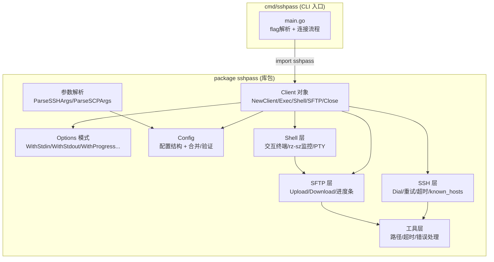

## 用户需求

将当前 win-sshpass 项目从纯 CLI 工具重构为可复用的 Go SDK 库，同时保留原有全部 CLI 功能不变。其他开发者通过 `import "github.com/chuccp/win-sshpass"` 引入此包后，可以快速构建自己的 SSH 客户端应用。

## 产品概述

项目从单包 `package main` CLI 工具改造为标准 Go 库包 `package sshpass`，根目录承载可复用库逻辑，CLI 入口移至 `cmd/sshpass/`。核心提供 `Client` 对象风格的 API：`NewClient(config, opts...)` 返回连接好的客户端，支持 `Exec`/`Shell`/`SFTP` 等操作，并通过 Options 模式支持自定义 IO 流、进度回调、文件选择回调等扩展点。

## 核心功能

- 库包导出 `Client` 对象，提供 `NewClient`、`Exec`、`Shell`、`SFTP`、`Close` 等方法
- Options 模式扩展：`WithStdin`/`WithStdout`/`WithStderr`/`WithProgressReporter`/`WithFileSelector`/`WithSignalHandler`
- 导出底层函数 `Dial`/`LoadConfig`/`ParseSSHArgs` 等供高级用户使用
- 原有 CLI 功能完全保留：ssh 连接、scp/rsync 传输、交互式 shell（含 rz/sz）、配置文件、密码/密钥认证、重试、超时
- 解耦终端耦合：`os.Exit`→返回 error、硬编码 `os.Stdin/Stdout`→可注入 IO、zenity 对话框→可替换接口

## Tech Stack

- 语言：Go 1.26（沿用现有）
- SSH 协议：`golang.org/x/crypto/ssh`（沿用）
- SFTP：`github.com/pkg/sftp`（沿用）
- 进度条：`github.com/schollz/progressbar/v3`（沿用，抽象为接口）
- 文件对话框：`github.com/ncruces/zenity`（沿用，抽象为接口）
- 终端：`golang.org/x/term`（沿用）
- 构建工具：Go modules + GitHub Actions（调整路径）

## Implementation Approach

### 核心策略

采用**方案B**包结构：根目录改为 `package sshpass` 库包，CLI 入口移至 `cmd/sshpass/main.go`。采用**Client 对象风格** API，通过 functional options 模式实现扩展性。

### 关键技术决策

**1. 包结构重组（方案B）**

- 根目录所有 `.go` 文件从 `package main` 改为 `package sshpass`
- 新建 `cmd/sshpass/main.go` 承载 CLI 入口（从现有 `main.go` 提取 flag 解析与连接流程）
- `version.go` 导出 `Version` 变量（小写 `version` → 大写 `Version`），供 CLI 包引用
- `printUsage`/`printVersion` 等 CLI 专属函数移至 `cmd/sshpass/` 下

**2. Client 对象 + Options 模式**

```
// 核心接口定义（不包含实现）
type Client struct {
    config    *Config
    sshClient *ssh.Client
    stdin     io.Reader
    stdout    io.Writer
    stderr    io.Writer
    progress  ProgressReporter
    selector  FileSelector
    // ...
}

type Option func(*Client)
func NewClient(config *Config, opts ...Option) (*Client, error)
func (c *Client) Exec(cmd string) error
func (c *Client) Shell() error
func (c *Client) SFTP() (*SFTPClient, error)
func (c *Client) Close() error
```

**3. 解耦终端耦合（7处关键改动）**

| 当前耦合点 | 位置 | 改造方案 |
| --- | --- | --- |
| `fatalError` 调用 `os.Exit(1)` | `util.go:203` | 库内改为返回 `error`；CLI 层负责打印和退出 |
| `runShell`/`executeCommand` 绑定 `os.Stdin/Stdout` | `ssh.go:179,244` | 改为使用 `Client.stdin/stdout/stderr` 字段 |
| `connectSFTP` 绑定 `os.Stdin/Stdout` | `sftp.go:34` | 通过 `Client` 字段注入 IO |
| `onInterrupt` 注册全局信号 | `util.go:213` | 改为 `WithSignalHandler` 可选项，默认不注册 |
| `setupOperationTimeout` 写 `os.Stderr` | `util.go:174` | 改为使用 `Client.stderr` |
| `createProgressBar` 写死 `os.Stderr` | `sftp.go:69` | 抽象为 `ProgressReporter` 接口，默认实现写 stderr，可关闭 |
| `showFileOpenDialog`/`showFileSaveDialog` 依赖 zenity | `shell_transfer.go:245,253` | 抽象为 `FileSelector` 接口，默认实现用 zenity，可替换 |
| `cleanRemotePath` 调用 `fatalError` | `util.go:90` | 改为返回 `error` |


**4. 抽象接口设计**

```
// ProgressReporter abstracts progress bar for file transfers.
type ProgressReporter interface {
    NewProgress(description string, total int64) Progress
}

// Progress represents a single progress tracker.
type Progress interface {
    Write(p []byte) (int, error)  // implement io.Writer for TeeReader
    Finish() error
}

// FileSelector abstracts file open/save dialogs.
type FileSelector interface {
    OpenFile() (string, error)
    SaveFile(defaultName string) (string, error)
}
```

**5. 底层函数导出**

- `SSHClient` → 导出为 `Dial(config *Config) (*ssh.Client, error)`
- `parseConfigFile` → 导出为 `LoadConfig(filename string) (*Config, error)`
- `parseSSHArgs`/`parseSCPArgs`/`parseRsyncArgs` → 导出（首字母大写）
- `detectCommandType` → 导出为 `DetectCommandType`

### 性能与可靠性

- SSH 连接的指数退避重试逻辑保持不变（`ssh.go:77-103`），时间复杂度 O(attempts)
- SFTP 传输的 `timeoutReader/timeoutWriter` 装饰器保持不变，确保大文件传输时超时正确刷新
- 进度条使用 `io.TeeReader` 零拷贝管道，无额外内存开销
- `Client.Close()` 确保连接正确清理，遵循 LIFO 顺序（SFTP→timer→SSH client）

### 避免技术债

- 复用现有 `Config`/`mergeFrom`/`mergeConfig` 逻辑，不重新设计配置体系
- 复用现有重试/超时/认证逻辑，仅解耦 IO 和退出行为
- 测试文件跟随包名迁移，保持测试覆盖不丢失

## Architecture Design

### 系统架构图



### 数据流

```
SDK 用户: sshpass.NewClient(cfg, opts...) → Client（内部 Dial 建立连接）
  → client.Exec("ls")    → 新建 Session → 绑定 Client.IO → Run → 返回 error
  → client.Shell()       → 新建 Session → PTY + raw 模式 → rz/sz 监控 → Wait
  → client.SFTP()        → sftp.NewClient → 包装为 SFTPClient → Upload/Download
  → client.Close()       → 关闭 SSH 连接

CLI 用户: cmd/sshpass/main.go → flag 解析 → 构造 Config → sshpass.NewClient(cfg) → 同上
```

## Directory Structure

```
win-sshpass/                          # 根目录 → package sshpass（库包）
├── client.go                         # [NEW] Client 结构体、NewClient()、Exec()、Shell()、SFTP()、Close() 方法。Client 持有 ssh.Client 连接和可配置 IO 流，通过 Options 注入依赖。Exec 调用底层 executeCommand 并使用 Client 的 IO 字段；Shell 调用底层 runShell 并使用 Client 的 IO 字段；SFTP 返回 *SFTPClient 包装对象
├── options.go                        # [NEW] Option 类型与所有 With* 选项函数（WithStdin/WithStdout/WithStderr/WithProgressReporter/WithFileSelector/WithSignalHandler）。定义 ProgressReporter/Progress/FileSelector 接口，提供默认实现（defaultProgressReporter 使用 progressbar 写 stderr；defaultFileSelector 使用 zenity）
├── config.go                         # [MODIFY] package main → package sshpass。Config 结构与新函数 NewConfig() 替代 newDefaultConfig（导出）。内部保留 mergeFrom/mergeConfig/validate/normalize 逻辑不变。导出 LoadConfig 替代 parseConfigFile
├── ssh.go                            # [MODIFY] package main → package sshpass。SSHClient 改名为 Dial（保留 SSHClient 作为别名）。runShell/executeCommand 改为接收 io.Reader/io.Writer 参数而非直接用 os.Stdin/Stdout。移除 setupOperationTimeout 中的 os.Stderr 硬编码
├── sftp.go                           # [MODIFY] package main → package sshpass。sftpConnection 改为 SFTPClient 并导出。connectSFTP 改为接收 Client 引用以获取 IO 配置。createProgressBar 改为通过 ProgressReporter 接口创建
├── scp.go                            # [MODIFY] package main → package sshpass。runSCP/runRsync 改为接收 Client 参数，使用 Client.SFTP() 获取连接。cleanRemotePath 改为返回 error
├── shell_transfer.go                 # [MODIFY] package main → package sshpass。rzszMonitor 改为接收 io.Reader/io.Writer 和 FileSelector 接口。showFileOpenDialog/showFileSaveDialog 改为 defaultFileSelector 的方法
├── args.go                           # [MODIFY] package main → package sshpass。导出 ParseSSHArgs/ParseSCPArgs/ParseRsyncArgs/DetectCommandType。移除 printUsage/printVersion（移至 CLI）
├── util.go                           # [MODIFY] package main → package sshpass。fatalError 移除（库不退出）。cleanRemotePath 返回 error。onInterrupt 改为可选。导出路径辅助函数（ParseUserHostPath 等）。setupOperationTimeout 接收 io.Writer 参数
├── version.go                        # [MODIFY] package main → package sshpass。version → Version（导出）
├── ssh_resize_unix.go                # [MODIFY] package main → package sshpass
├── ssh_resize_windows.go             # [MODIFY] package main → package sshpass
├── doc.go                            # [NEW] 包文档注释，示例用法
├── cmd/
│   └── sshpass/
│       └── main.go                   # [NEW] CLI 入口。从原 main.go 提取 flag 解析、配置合并、命令分发逻辑。使用 sshpass.NewClient() API 创建客户端，处理 os.Exit 和信号注册。包含 printUsage/printVersion
├── config_test.go                    # [MODIFY] package main → package sshpass
├── util_test.go                      # [MODIFY] package main → package sshpass。调整 cleanRemotePath 测试为 error 返回
├── args_test.go                      # [MODIFY] package main → package sshpass
├── shell_transfer_test.go            # [MODIFY] package main → package sshpass
├── go.mod                            # [不变]
├── go.sum                            # [不变]
├── .github/workflows/release.yml     # [MODIFY] 构建命令改为 go build -o win-sshpass.exe ./cmd/sshpass；version.go 注入改为 package sshpass + Version
├── CLAUDE.md                         # [MODIFY] 构建命令改为 go build -o win-sshpass.exe ./cmd/sshpass；更新架构说明
└── README.md                         # [MODIFY] 新增 SDK 使用示例章节
```

## Implementation Notes

### 执行注意事项

- **fatalError 清理**：库代码中所有 `fatalError` 调用必须改为返回 `error`。当前出现在 `util.go:90`（cleanRemotePath）和 `main.go` 多处。main.go 中的 fatalError 调用保留在 CLI 层（cmd/sshpass/main.go）
- **IO 流传递链**：`Client.stdin/stdout/stderr` 默认设为 `os.Stdin/os.Stdout/os.Stderr`，通过 Options 可覆盖。`runShell`/`executeCommand`/`connectSFTP` 等函数签名需增加 IO 参数或接收 Client 引用
- **version.go CI 注入**：release.yml 第39行 `$content = "package main..."` 必须改为 `"package sshpass..."` 且 `version` → `Version`，否则 CI 构建会失败
- **构建路径**：release.yml 第43行 `go build ... .` 改为 `go build ... ./cmd/sshpass`；CLAUDE.md 同步更新
- **测试迁移**：4个测试文件改包名后，需检查 `cleanRemotePath` 测试（util_test.go）是否依赖 fatalError 行为，改为断言 error 返回
- **向后兼容**：导出 `SSHClient` 作为 `Dial` 的别名函数，避免破坏可能的已有引用
- **信号处理**：`onInterrupt` 默认不注册，仅当用户传入 `WithSignalHandler()` 时才注册 `os.Interrupt` 监听。CLI 层默认启用

### 性能注意

- SFTP 大文件传输的 `timeoutReader/timeoutWriter` 装饰器模式保持不变，避免引入额外缓冲
- `ProgressReporter` 接口的 `Write` 方法需与 `io.TeeReader` 配合，确保零拷贝管道不被破坏
- Client 复用底层 `*ssh.Client` 连接，多次 `Exec` 调用各自创建独立 Session，无连接复用开销

## Agent Extensions

### SubAgent

- **code-explorer**
- Purpose: 在重构过程中深入搜索跨文件的函数调用链和依赖关系，确保所有 fatalError/onInterrupt/os.Stdin 引用点都被正确处理
- Expected outcome: 确认所有终端耦合点的完整清单，避免遗漏导致编译错误